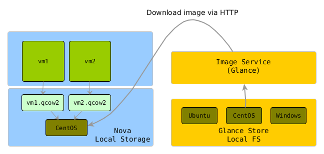
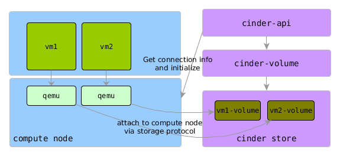
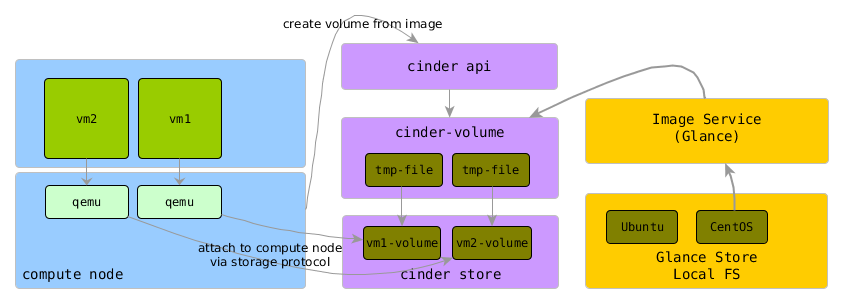
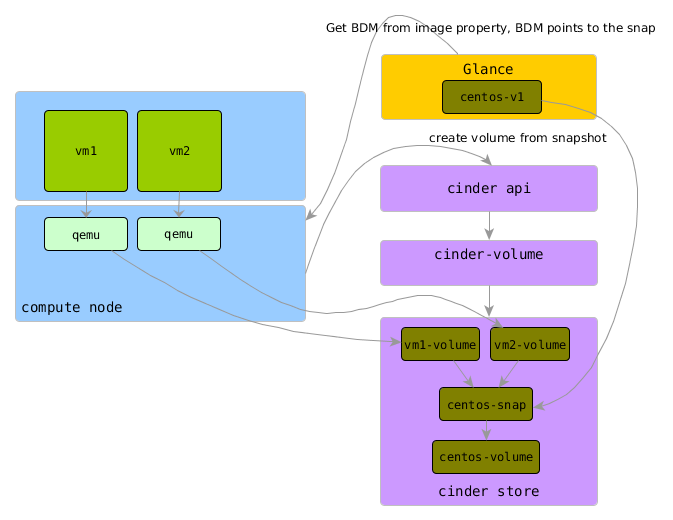
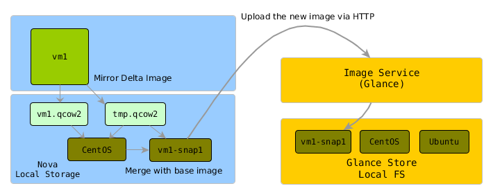
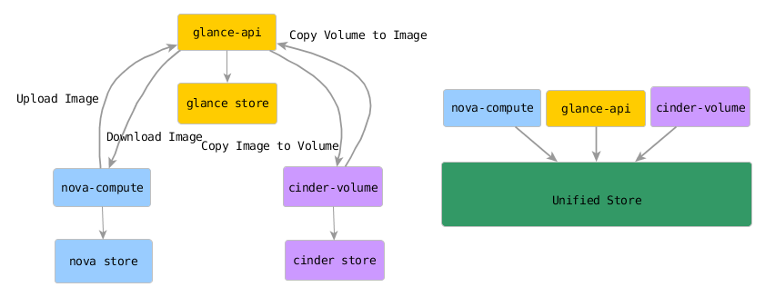
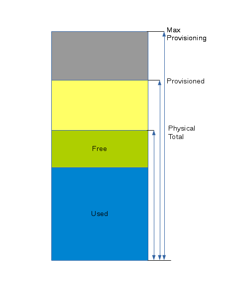
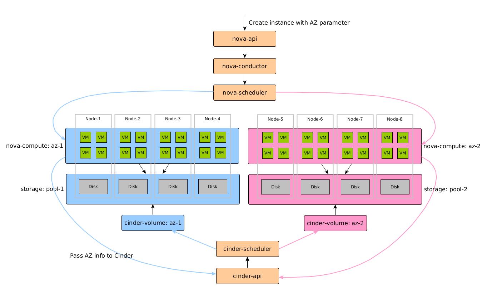
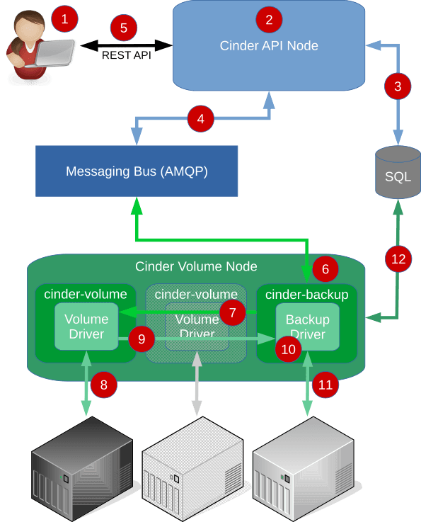

# OpenStack Block Storage Revistied

<div style="text-align:center">Mark Wu</div>

#HSLIDE


### Agenda

- **Image, Snapshot and BDM**
- Unified store for Image, Instance and Volume
- Cinder's Features

#HSLIDE

#### BDM (Block Device Mapping)

- Describes virtual disk's properties
  - data source
  - destination
  - boot index
  - device bus
  - ...
- Examples:
  - --block-device source=image,id=xxx,dest=volume,size=1,bootindex=0 
  - [Launch an instance from a volume](http://docs.openstack.org/user-guide/cli-nova-launch-instance-from-volume.html)


#HSLIDE

### BDM

- Root Disk

| Source        | Dest        | Desc                            |
| --------------|-------------|---------------------------------|
| image         | local       | Boot from image to Nova's store |
| image         | volume      | Boot from image to volume       |
| volume        | volume      | Boot from volume directly       |
| snapshot      | volume      | Boot from volume's snapshot     |

#VSLIDE

### BDM
- Other Disks

| Source        | Dest        | Desc                           |
| ------------- |-------------|--------------------------------|
| blank         | local       | format=swap, swap disk         |
| blank         | local       | ephemeral disk on local store  |
| blank         | volume      | Attach data volume during boot |


#HSLIDE
### Boot from local (downloading image)


#VSLIDE?gist=59000923efed8e2a9cc4cd4df6b7c789

#VSLIDE
### Boot from volume directly

#VSLIDE?gist=d361a7a00db3952e107926aa9f0c758a

#VSLIDE
### Boot from volume (downloading image)

#VSLIDE?gist=aa189d97910b63a231162e017b28af46

#VSLIDE
### Boot from volume snapshot


#HSLIDE

### Snapshot
- The same as images upload directly to glance except the following fields:
  - image_type = snapshot, which causes the snapshot hidden from image list
  - base_image_ref: original image
  - instance_uuid: the instance which this snapshot is taken from
- No memory state included
- No rollback support. Restore by creating new instance from the snapshot

#VSLIDE

### Instance Snapshot - Live
- Implementation 
  - Boot from local store
    - Qemu mirrors the delta image, merge and upload
    - No incremantal copy support
  - Boot from Ceph - Use Ceph's snapshot, clone and flatten
  - Boot fron volume - Create snapshot via cinder
- Data consistency
  - fsfreeze

#VSLIDE
### Snapshot for Instances backed by local store 


#VSLIDE?gist=e8cbefb2ee8e11aec85bd7e466729096

#VSLIDE
### Snapshot for Instances backed by Ceph 


#VSLIDE
### Snapshot for Instances backed by cinder volume


#VSLIDE?gist=6e37c1ba879da254247e2aa24caea952

#HSLIDE
### Cloud Design Pattern
- Stamp Pattern
  - Packer


#VSLIDE
### Cloud Design Pattern
- Snapshot Pattern


#HSLIDE

### Agenda

- Image, Snapshot and BDM
- **Unified store for Image, Instance and Volume**
- Cinder's Features

#HSLIDE
### Overview


- Unified store
  - Expose image direct location
  - Utilize storage's COW

#HSLIDE
### NFS backed
- Configuration 
  - glance.conf: show_multiple_locations = True
  - nova.conf: allowed_direct_url_schemes = file
  - Ref: [OpenStack Glance NFS and Compute local direct fetch](https://www.sebastien-han.fr/blog/2015/03/16/openstack-glance-nfs-and-compute-local-direct-fetch/)
- Skip downloading image by using copy over nfs
- Still lacks of COW support

#VSLIDE
### Ceph backed
  


#VSLIDE?gist=4ef46207250ba83554937ddff2346290

#VSLIDE
### Cinder volume backed

- Use cinder as glance store
- Expose image store location with cinder URI
- Utilize volume clone to create volume from image
- Can't be done with snapshot because no public snapshot support
- Refs:
  - [Efficient Image Management using Cinder Volumes for Virtual and Baremetal Machines](http://schd.ws/hosted_files/openstacksummitoctober2015tokyo/ae/Efficient%20Image%20Management%20using%20Cinder%20Volumes%20for%20Virtual%20and%20Baremetal%20Machines.pdf)
	
#VSLIDE?gist=1360707c4830fcfa2ae769e8570d5c6f

#HSLIDE

### Agenda

- Image, Snapshot and BDM
- Unified store for Image, Instance and Volume
- **Cinder's Features**


#HSLIDE
### Volume Type

- Differentiate storage offerings
- Matched aginst volume driver's capabilities by Schduler filter
- Keys
  - Default Capabilities
    - volume_backend_name
    - vendor_name
    - driver_version
    - storage_protocol
  - Extras Specs
    - Driver/vendor specific capabilities

#VSLIDE?gist=e630c5502dcf387ee78e53d004bb80ff

#HSLIDE
### QoS
- A sort of extra specs
- Enforced at:
  - frontend - Hypervisor side
  - backend - Storage side
- Difference from nova flavor's QoS settings
  - flavor's QoS only applied on disks backed by nova instance store

#VSLIDE?gist=c43a6c2a8b4a02dc04cca02273fecfe5

#VSLIDE?gist=c2d7d0594c10e39172a87c586ad1c84c


#HSLIDE
### Thin provisioning
- Only for TP's capacity management, not for dataplane 
- Scheduler's capacity_filter check:
  - provisioned_ratio <= max_over_subscription_ratio
  - free * max_over_subscription_ratio >= volume_size
- Lack of capacity report and monitoring

#VSLIDE
### Thin provisioning


#HSLIDE
### Availability Zone


#VSLIDE?gist=d84cf47c4e9dda908c8efd5f6057900f

#HSLIDE
### Volume Migration
- Same volume type, two cinder volume backends (could share the same storage)
- Move data, not instances
- Fast copy could be done if moving within the same storage and it supports it 
- Generic approach
  - volume in-use: mirror data to the new created volume by qemu
  - volume available: host copy (dd)  
```
cinder migrate [--force-host-copy [<True|False>]]
               [--lock-volume [<True|False>]]
	                      <volume> <host>
```
#VSLIDE
### Volume Retype
- Different volume types, same volume backend or not
- Could just change some settings like QoS without moving data 
- Move data if necessary and allowed 
```
cinder retype --migration-policy on-demand
              <volume> <volume-type>
```

#HSLIDE
### Backup


#VSLIDE
### Backup
- Incremental Backup
  - driver swift and nfs
    - split volume data into chunks
    - calculate SHA256 individually and compare on each backup
    - Not every efficient
      - CPU intensive
      - Read all original data on every backup
#VSLIDE
### Backup
- Incremental Backup
  - driver ceph
    - incremental backup only available if original storage is ceph  
    - rbd export/import
  - Use dirty block tracking?

#VSLIDE
### Backup
- Support non-disruptive-backup from Liberty
  - temporary snapshot if backup_use_temp_snapshot is True
  - otherwise temporary volume

- Orchestraed with Karbor
  - Example: http://docs.openstack.org/developer/karbor/usage.html

- [Migrating Cinder volumes between OpenStack envs](http://blog.oddbit.com/2015/09/29/migrating-cinder-volumes-between-openstack-environments/)

#HSLIDE
### Reference 
- http://www.snia.org/sites/default/files/SDC/2016/presentations/cloud/SeanMcGinnis_Introduction_To_Cinder.pdf
- http://www.snia.org/sites/default/files/SDCIndia/2016/Presentations/Using%20Object%20Storage%20to%20store%20and%20restore%20Cinder%20Volume%20backups.pdf
- https://gorka.eguileor.com/category/technology/cloud/openstack/
- http://www.slideshare.net/ebalduf/cinder-live-migration-and-replication-openstack-summit-austin
- http://blog.oddbit.com/2015/09/29/migrating-cinder-volumes-between-openstack-environments/
- https://www.sebastien-han.fr/blog/2015/10/05/openstack-nova-snapshots-on-ceph-rbd/
- http://cloudacademy.com/blog/aws-cloud-design-patterns/
